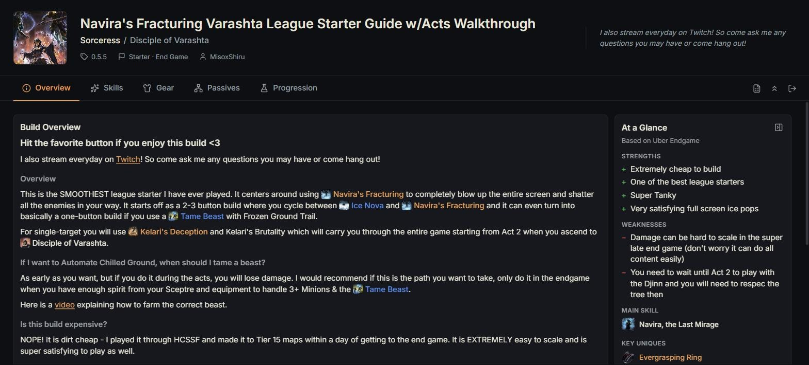
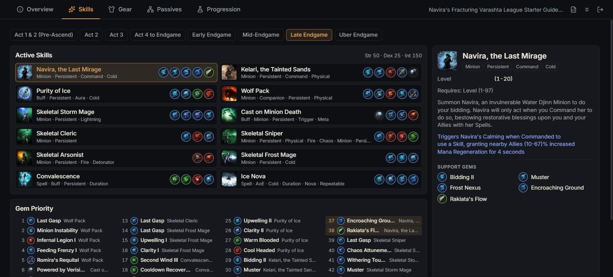
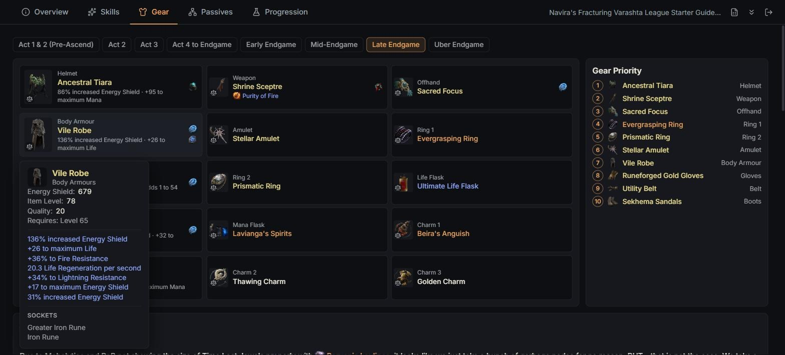
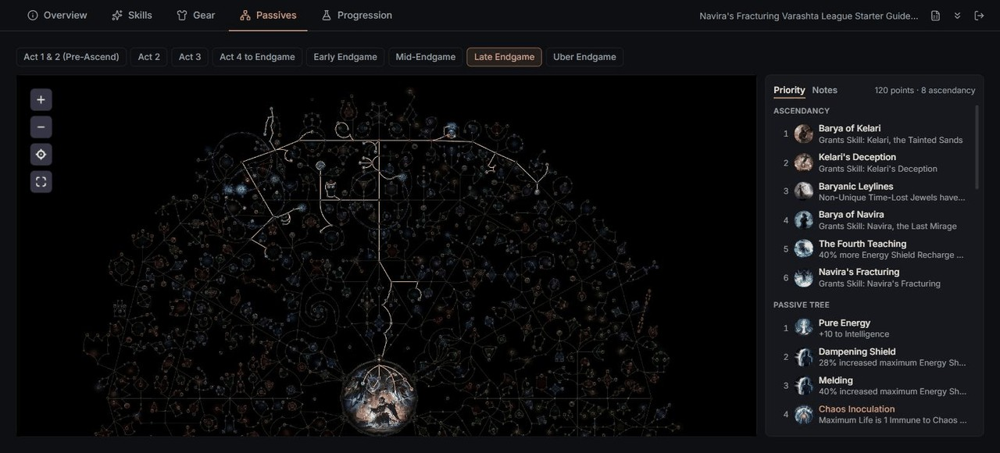
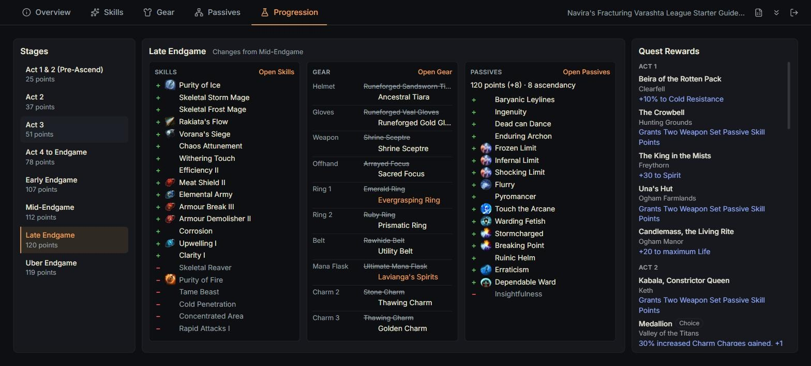

# poe2perfect

**A better way to read Path of Exile 2 builds on Mobalytics.**

One click turns a long build page into tabs: skills, gear, passives and progression each fit on one screen, with game
tooltips for everything.

[](https://chromewebstore.google.com/detail/poe2perfect/iaalfjcbfnidaiogadcgcdcfgmekpnce)
[](LICENSE)



<sub>Overview: the author's guide, with strengths, weaknesses, main skill, key uniques and ascendancy at a glance.
Build shown throughout: Navira's Fracturing Varashta by MisoxShiru.</sub>

## What does it do?

- **Tabs instead of one long page.** Overview, Skills, Gear, Passives, Atlas Tree and Progression, each on one screen.
- **Game-style tooltips** for items, gems, passives, runes and anything the author mentions in the text.
- **Straight to the game.** Click a gem to copy its name for the in-game search; open any item on the official
  trade site with its filters already set.
- **The original is one click away.** Switch back to the Mobalytics page at any time.

## Installation

**[Add poe2perfect to Chrome](https://chromewebstore.google.com/detail/poe2perfect/iaalfjcbfnidaiogadcgcdcfgmekpnce)**,
then open any PoE 2 build on [mobalytics.gg](https://mobalytics.gg/poe-2/builds). It works whether or not you are
signed in to the site.

## A look at every tab

### Skills

Active skills with their supports, the author's gem priority, and the full details of the skill you pick. Click any
gem to copy its name for the in-game search; hover a gem in the priority list to see which skill it goes into.



### Gear

Every slot on one screen, with sockets, runes, granted skills and the author's gear priority. Tooltips read like the
game's own and show the base item's modifier above the rolled ones; the scales icon opens the item on the official
trade site with its filters already set.



### Passives and Atlas Tree

The site's own tree, with zoom and pan, next to the author's passive priority — ascendancy first, then the tree.
Hover a passive in the list to highlight it on the tree; click it to move the camera there.



### Progression

What each stage changes from Act 1 to endgame — skills and supports gained and dropped, gear slot by slot, passive
points and new nodes — with the campaign quest rewards beside it.



### Save it as a spreadsheet

The button in the tab bar writes an .xlsx workbook: the build itself (Gear, Skills, Gem Priority, Passives, Quest
Rewards) and, beside it, the numbers. Every modifier of every item, rune and passive lands on a **Stats** sheet, and
a **Totals** sheet adds them up by formula, per variant:

| Stat | Flat | Increased % | Estimate |
| --- | --- | --- | --- |
| Maximum Life | 375 | — | 375 |
| Maximum Energy Shield | 177 | 276 | 665 |
| Fire Resistance | 93 | — | 93 |

Change a roll, drop a row or add your own and the totals follow. Excel opens it; Google Sheets imports it.

### And also

- **Build variants** (Act 1, Endgame…) switch with one click; number keys 1–6 switch tabs.
- **Picks up where you left off**: each build reopens on the tab and act you were reading. A build you open for the
  first time starts on Overview.
- **The original is one click away**, and the header collapses to leave the build more room.

## Roadmap

- The same totals inside the guide itself, not only in the spreadsheet.
- More testing on builds of every class — builds that look wrong are the most useful bug reports.

## Feedback

Found a bug or have an idea? [Open an issue](https://github.com/ReSenpai/poe2perfect/issues). A link to the build
you were reading helps a lot.

## ☕ Support the project

poe2perfect is a free, open-source Chrome extension. It is licensed under GPL-3.0 and costs nothing to use.

If the extension turned out useful and you would like to support further development, you can donate voluntarily:

**[☕ Support on Boosty](https://boosty.to/resenpai)**

Support is voluntary. It does not unlock features, access to the extension or any other advantages.

## Privacy and permissions

The extension runs only on mobalytics.gg, sends nothing anywhere else and keeps its display preferences in your
browser. See [PRIVACY.md](PRIVACY.md).

- Permission: `storage` only (local display preferences: guide or original page, collapsed panels, and the tab and
  variant last read in each of the last 30 builds).
- Runs on `https://mobalytics.gg/*`. Build data comes from the page itself; game data for tooltips comes from the
  site's own IndexedDB cache.

Unofficial, not affiliated with Mobalytics or Grinding Gear Games. Path of Exile is a trademark of Grinding Gear
Games; build guides and game data come from mobalytics.gg at run time and belong to their owners.

## License

poe2perfect is free software, released under the [GNU General Public License v3.0 or later](LICENSE).
You may use, study, share and change it; if you distribute a modified version, it must stay under the GPL with its
source code available. Copyright (C) 2026 ReSenpai.

The name "poe2perfect" and its logo are not covered by the license: forks need their own name and logo.
Third-party components and their licenses are listed in [NOTICE](NOTICE).

## Contributing

See [CONTRIBUTING.md](CONTRIBUTING.md). In short: tests first, English UI strings, and contributions are licensed
under the GPL like the rest of the project. Changes between versions are listed in [CHANGELOG.md](CHANGELOG.md).

## Development

```sh
npm install
npm run dev        # dev build in .output/chrome-mv3-dev (load it unpacked; reloads on save)
npm test           # Vitest
npm run typecheck
npm run build      # production build in .output/chrome-mv3
npm run zip        # .output/poe2perfect-<version>-chrome.zip
```

To try a build without the store, open `chrome://extensions`, turn on **Developer mode**, click **Load unpacked** and
pick the folder with `manifest.json`.

Stack: WXT, Preact, TypeScript, Vitest with happy-dom. The plan and findings about the site's data live in
`docs/PLAN.md`; the design system in `reference/DESIGN.md`. Icons are generated into `public/icon/`.
